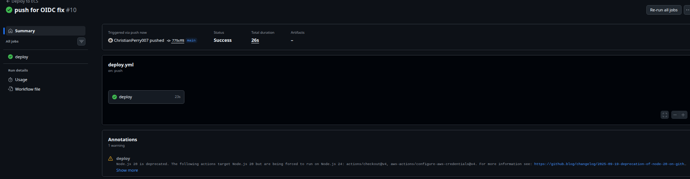
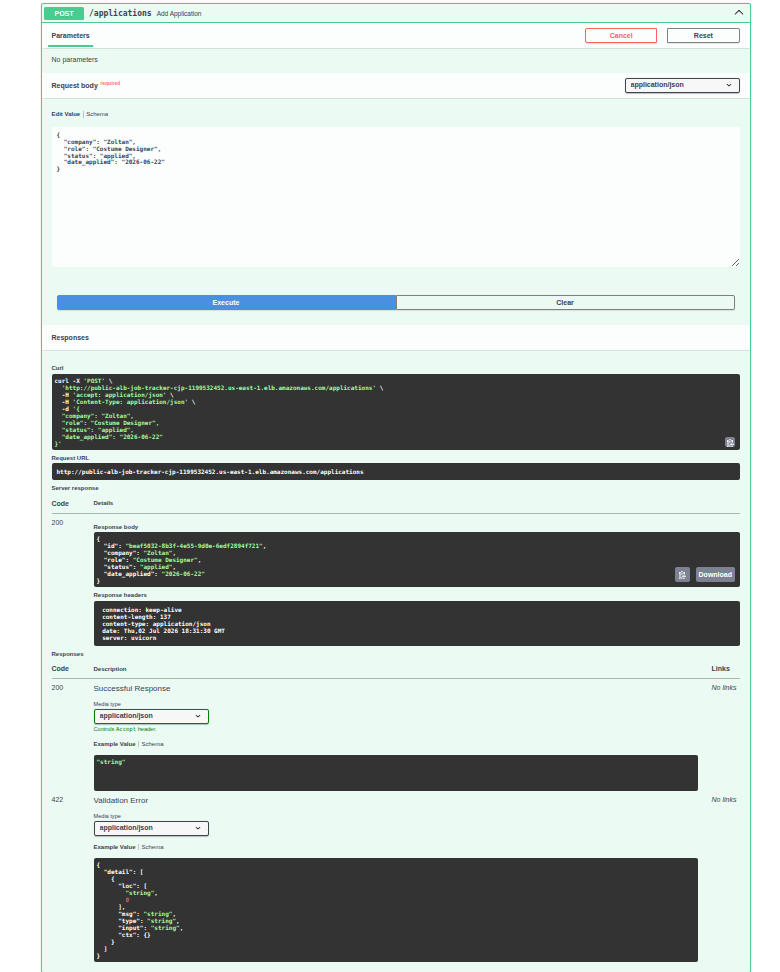
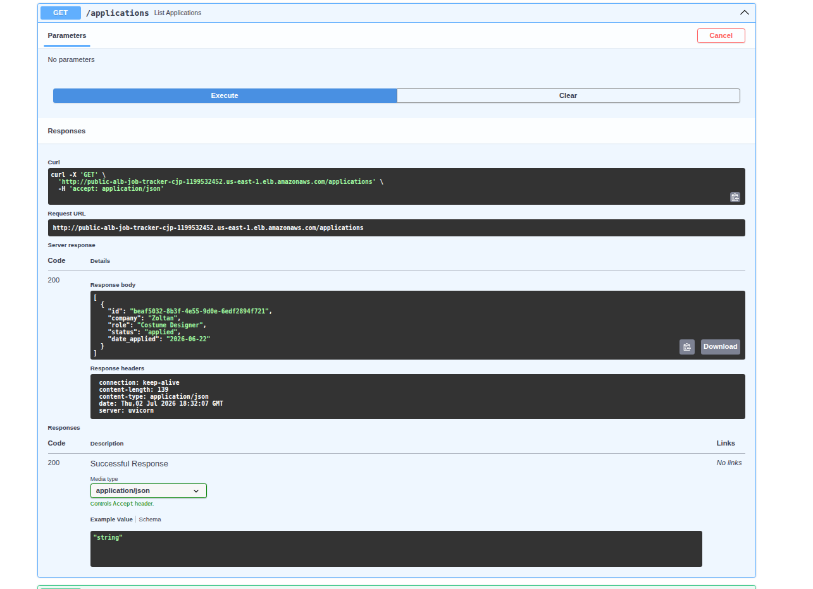
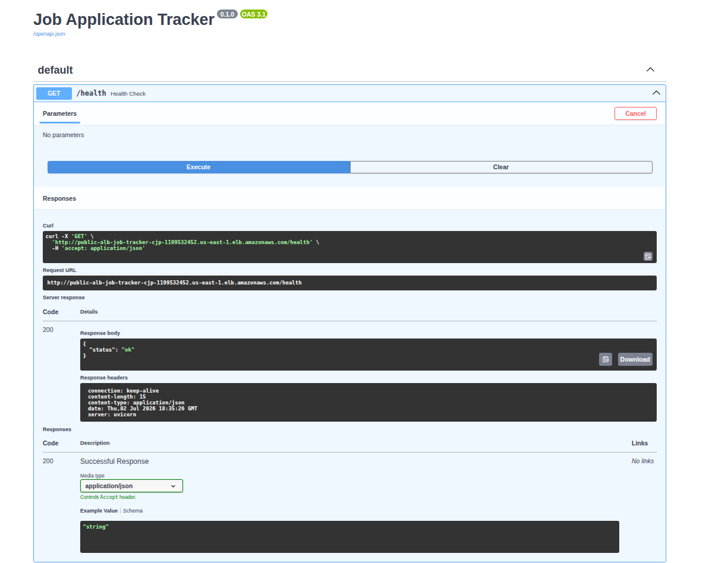
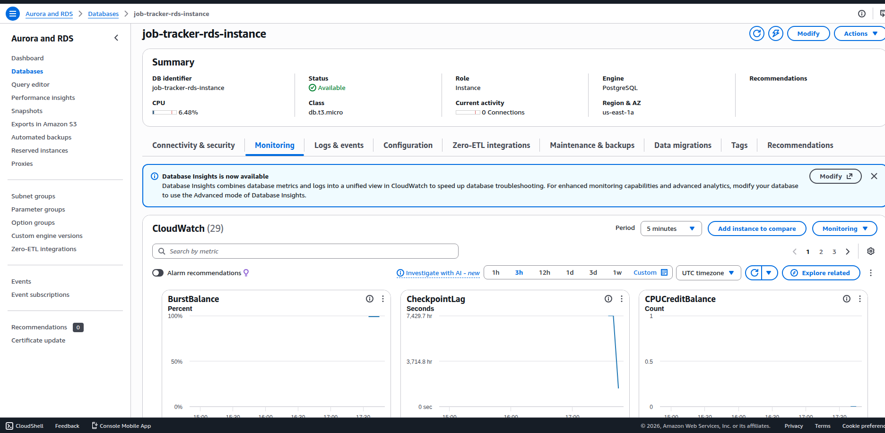

# Job Tracker Application Containerized on AWS ECS

This Job Application Tracker REST API project demonstrates a production grade cloud infrastructure deployment on AWS. This solves a real problem I face during my cloud engineering job search when tracking my applications, status updates, and various issues to other companies. 
The focus for this project isn't necessarily the application itself, but more focus on the infrastructure it runs on:
- A custom 3 tier Multi-AZ VPC
- Containerized workloads on ECS with EC2 launch type (original code made as a docker image)
- A PostgreSQL database on RDS Multi-AZ 
- An Application Load Balancer where traffic has to pass through multiple Security Groups (ALB, ECS, and RDS)
- Full IaC with Terraform
- An automated CI/CD pipeline using GitHub Actions with OIDC authentication

**Job Tracker Application Pipeline Diagram**


## What The Project Demonstrates:

**Containerization:** Dockerized FastAPI application built and pushed to AWS ECR

**ECS with EC2 Launch type:** Container orchestration on EC2 instance with an ASG

**Custom 3 Tier Web Application:** Public, Application (private), and Data (private) subnets across 2 Availability Zones

**Application Load Balancer:** Public facing traffic distribution to ECS with health checks

**Security Group Chaining:** SG1 (ALB) → SG2 (ECS) → SG3 (RDS) practicing least privilege network access
  
**NAT Gateway:** One per AZ for in public subnets for highly available outbound internet access from private subnets
  
**RDS PostgreSQL Multi-AZ:** Persistent relational database with auto failover
  
**Terraform IaC:** All AWS resources provisioned and managed as code
  
**GitHub Actions CI/CD:** Automated build, push to ECR, and ECS deployment for each commit
  
**OIDC Authentication:** Originally I had my keys stored in the repo settings but then found out about OIDC. Swapped to this for keyless AWS authentication since it uses temporary credentials
  
**IAM Least Privilege:** Separate task execution role, instance profile, and GitHub Actions role
  
**CloudWatch:** Container logging and insights enabled on the ECS cluster

## Tech Stack

**Application**
- Python 3.14 / Fast API / Uvicorn
- PostgreSQL (via psycopg2)

**Containerization & Registration**
- Docker (image for my job application tracker)
- AWS ECR (container registration for my docker image)

**Infrastructure**
- VPC ( custom 3 tier)
- Application Load Balancer 
- AWS ECS (containing docker image pulled from ECR)
- AWS EC2 (launch type for ECS) / Auto Scaling Group
- AWS RDS PostgreSQL (Multi AZ)
- Cloudwatch (monitoring)

**Infrastructure as Code (IaC)**
- Terraform

**CI/CD**
- GitHub Actions
- OIDC (keyless authentication with temporary credentials)

## Architecture Overview

The application runs inside a custom VPC across two AZ's for high availability, following a 3-tier architecture with Public, App private, and Data private subnets in each AZ. Inbound traffic flows from the internet through an Internet Gateway (IGW) to an Application Load Balancer (ALB) in the public subnets, which forwards requests to ECS tasks running in the App private subnets, which connect to RDS PostegreSQL in the Data private subnets. Outbound traffic from the ECS tasks routes through a NAT Gateway per AZ to reach outer services like ECR for image pulls.

EC2 launch type was chosen over Fargate for hands on experience with instance level networking and ASG capacity management. One NAT Gateway per AZ was a chosen on purpose because a single shared NAT would create a single point of failure and I want to avoid issues if preventable. The ALB replaces a traditional public EC2 web tier, keeping all compute in private subnets and reducing attack surface.


## Security Design

Three IAM roles were created following best practice of least privilege. The ECS Task Execution Role grants permission only to pull images from ECR and write logs to CloudWatch. The EC2 Instance Profile grants permission only for EC2 instances to register with the ECS cluster. The GitHub Actions Role grants permission only to push to ECR and update the ECS service, and is assumed through OIDC (no credentials are stored in the repo or pipeline). GitHub Actions authenticates using short lived tokens generated per pipeline run that expire after the job completes, eliminating the risk of credential exposure. 

Network security is enforced through security group chaining across all three tiers. SG1 allows inbound traffic from the internet on port 80 to the ALB only. SG2 allows inbound traffic on port 8000 from SG1, so only the ALB can reach the ECS tasks nothing else in the VPC can communicate with the containers directly. SG3 allows inbound traffic on port 5432 from SG2, therefore only the ECS tasks can reach the RDS database. All application compute and database resources run in private subnets so there isn't any direct internet exposure. The RDS password is generated using Terraform's `random_password` resource and is never hardcoded or stored in version control.

## CI/CD Pipeline

Every push to the `main` branch  triggers a GitHub Actions workflow that builds a new Docker image, pushes it to ECR, and forces a new ECS deployment. ECS then pulls the updated image and replaces running tasks with zero downtime and the new tasks run before the old ones stop.

As mentioned before, OIDC is used as temporary credentials so hardcoding isn't necessary in the repo's settings.

**CI/CD Fix**



## Results
**Post & Get Applications**




**ECS Clusters**


**Health Check**



**RDS PostgreSQL**



## What Broke & Debugging

**Target group target type mismatch:** `target_type` was set to `instance` but `awsvpc` network mode requires `ip` since each ECS task gets its own IP. ECS couldn't register tasks with the ALB until corrected.

**Launch type vs capacity provider conflict:** Having both `launch_type = "EC2"` and a `capacity_provider_strategy` causes a conflict. ECS showed "No Container Instances found" even though instances were active. Removing `launch_type` resolved it.

**ECS service drain timeout:** While `terraform destroy` was in motion, ECS was timing out at 20 when draining because of slow ALB target deregistration. Running `terraform destroy` for a second time seemed to fix that issue. 

**Listener dependency during target group recreation:** Changing `target_type` requires destroying and recreating the target group, but Terraform couldn't delete it while the listener was still attached. Going into the AWS Console resolved this issue.

**OIDC token validation failure:** Authentication failed due to a trailing space in `client_id_list` and a missing second thumbprint. I originally had my credentials hardcoded in the secrets manager section in the repo's settings, but then learned about OIDC. I did it that way, but accidentally deleted my `AWS_ACCOUNT_ID` so the repo knows what account is using these resources, it wouldn't pass, then I put that credential back, didn't pass again, and then remembered there were two thumbprints instead of one. Once I had those issues fixed, the push did pass. 

## What I'd Do Differently

- **Manage ECR in Terraform:** The ECR repository was created manually via AWS CLI before I launched Terraform was introduced. This happened because I was poking around with the Linux commands and wanted to at least launch 1 thing in the AWS CLI via terminal before moving over to VsCode.

- **Add HTTPS:** The ALB currently serves traffic on port 80 only. A production deployment would use an ACM certificate with a 443 listener and redirect HTTP to HTTPS.

- **Add ECS task auto scaling:** Current setup scales EC2 instances via ASG but doesn't scale ECS task count based on CPU/memory metrics. Adding a target tracking scaling policy on the ECS service would complete the auto scaling story.

- **Use Secrets Manager for RDS credentials:** currently using Terraform's `random_password` resource. Secrets Manager would provide automatic rotation and more secure runtime access.

## How to Deploy

**Prerequisites**
- AWS CLI configured with appropriate permissions
- Terraform >= 1.0
- Docker installed
- GitHub repository with `AWS_ACCOUNT_ID` secret set

**1. Clone the repository**
``` open terminal and paste:
git clone https://github.com/ChristianPerry007/ecs-job-tracker.git
cd ecs-job-tracker
```

**2. Create terraform.tfvars**

Create a `terraform.tfvars` file with your own values (see `variables.tf` for required variables). This file is gitignored and must be created locally.

**3. Initialize and apply Terraform**
``` # open terminal and paste these commands
terraform init
terraform plan
terraform apply
```

**4. Deploy the application**

Push any commit to the `main` branch. GitHub Actions will automatically build the Docker image, push it to ECR, and deploy to ECS.

**5. Access the API**

Once deployed, find the ALB DNS name in the AWS console under EC2 → Load Balancers and navigate to: 

http://your-alb-dns-name/docs

**Tear down**

In your terminal run `terraform destroy`


